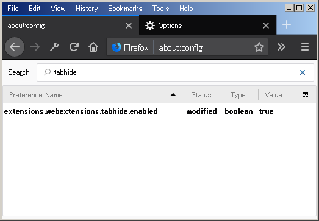

# SimplifiedTabGroup
Simple tab manegement webextension for firefox.

## requirements
Firefox 59+

Requires to set 'extensions.webextensions.tabhide.enabled' to true in 'about:config'.

Also set "Show your windows and tabs from last time" in General option.

## install
This version may contain bugs. So please install at your own risk.

[xpi](https://github.com/bulkn/SimplifiedTabGroup/releases/download/0.1.11/simplifiedtabgroup-0.1.11-an.fx.xpi)
